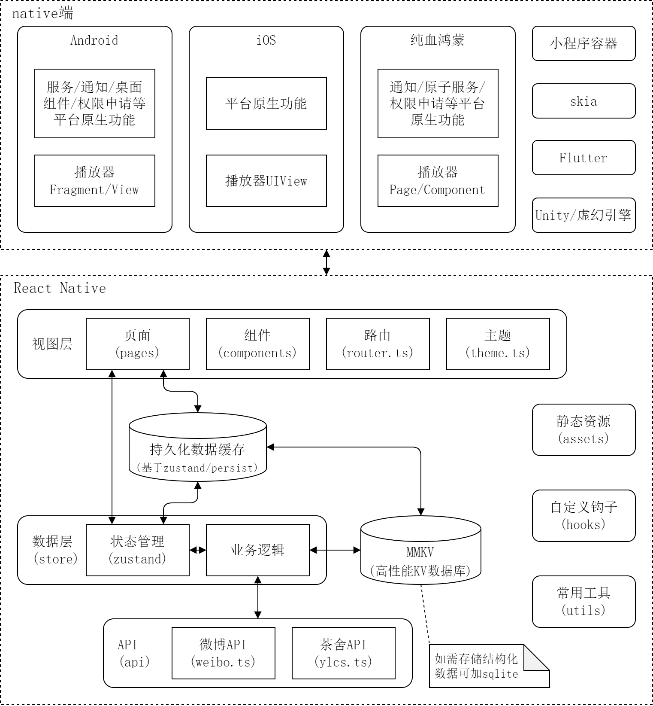

# 银临茶舍 - 移动端 APP

## 简介

银临茶舍 APP，集资讯、听歌、美图、论坛、社交于一体的小银子聚集地。

该仓库为使用 React Native/Kotlin Multiplatform 开发的客户端应用，支持 Android、iOS 和纯血鸿蒙平台。

其中 rn 因开发简单、支持热更新、可复用 Web 端资源而主要用于资讯和社交等业务，kmp 因无需桥接、性能高、开发体验接近 Android 而主要用于音乐播放器和提供平台原生功能，每个平台都通过壳应用将 native、rn 和 kmp 桥接在一起，形成一套完善的、体验接近原生 App 的跨端解决方案。

## 环境配置

前提条件：

- Node.js >= 18.0
- Android Studio
- Xcode
- Huawei DevEco Studio

安装依赖：

```sh
# 我们暂时使用 npm 包管理器
npm install
# ios 平台安装依赖
# 旧架构
cd ios
pod install
# 新架构（必须从npm脚本运行，否则需要自行配置环境变量）
npm run pod-install
# HarmonyOS 平台生成桥接代码（鸿蒙rn暂未支持AutoLink）
npm run ohos:codegen
```

## 如何调试

### 一键启动模拟器并调试

```sh
# Android
npm run android

# iOS
npm run ios

# HarmonyOS
# 暂不支持 TAT
```

稍等片刻，你将会看到应用启动并运行在模拟器或真机上。

### 手动构建并在模拟器或真机上调试

首先启动本地调试服务器：

```sh
npm start
```

然后运行应用：

```sh
# Android
adb reverse tcp:8081 tcp:8081
# 使用 Android Studio 打开 android 目录，并调试 app 目标。

# iOS
# 使用 Xcode 打开 ios 目录下的 ylcs.xcworkspace 工作区，然后运行 ylcs 目标。
# 应用启动后可能需要摇晃手机打开开发者菜单，设置热更新服务器地址为刚才启动的服务器的地址。

# HarmonyOS
npm run ohos:dev
hdc rport tcp:8081 tcp:8081
# 然后使用 DevEco Studio 打开 harmony 目录，并调试 entry 目标。
```

## 构建打包

### Android

首先使用 Android Studio 打开 `android` 目录，配置签名，然后执行下列命令进行构建：

```sh
cd android
# Linux/macOS
./gradlew assembleRelease
# Windows
gradlew.bat assembleRelease
```

生成的 apk 安装包位于 `android/app/build/outputs/apk/release/app-release.apk`。

### iOS

使用 Xcode 打开 `ios` 目录下的 `ylcs.xcworkspace` 工作区，然后配置 `ylcs` 目标的签名，再进行构建。

### HarmonyOS

```sh
npm run ohos:release
```

然后使用 DevEco Studio 打开 `harmony` 目录，配置签名，手动进行构建。

## 项目架构



## 代码规范

js/ts 代码规范以 eslint 为准，native 代码暂无规范要求。

Git commit 信息采用约定式提交规范，可前往 [Conventional Commits](https://www.conventionalcommits.org/zh-hans/v1.0.0/) 学习。提交信息不强制使用英文，可使用中文。

APP 版本号遵循语义化版本，且多端采用统一版本号，只需修改根目录下的 `app.json` 中的版本字段即可同步修改所有端的版本号，无需额外操作。`version` 字段为语义化版本号，用于展示给用户，`versionCode` 字段为用户不可见的内部版本号，用于版本比较，判断应用是否需要更新。

## 版权声明

银临茶舍项目组 版权所有
